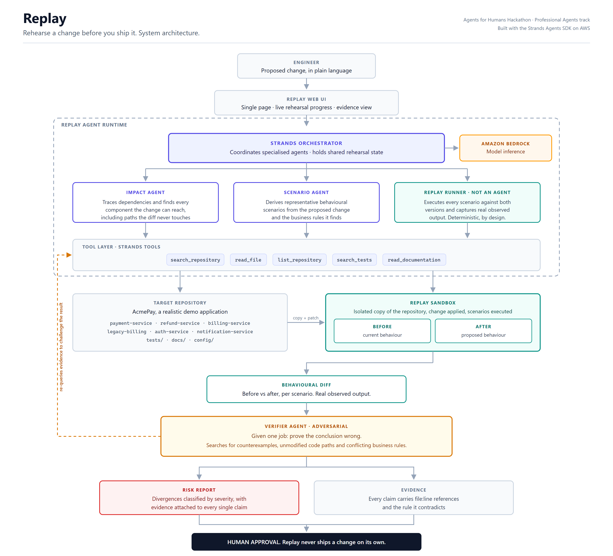

# Replay

**Rehearse a change before you ship it.**

Every production change carries consequences that aren't visible in the diff.
Replay takes a proposed change in plain language, works out what it can reach,
designs behavioural scenarios, **actually executes them against the current and
the proposed code**, compares the real observed results, and then has a separate
agent try to prove that conclusion wrong.

Built with the [Strands Agents SDK](https://strandsagents.com) on AWS.

---

## Why this is not change-impact analysis

Existing tools answer *"what might be affected?"* Replay answers *"what actually
behaved differently, and does that break a rule?"*

The difference is that Replay runs an experiment. Scenarios execute as real
subprocesses inside isolated copies of the repository - one pristine, one with
the change applied. If Replay claims behaviour changed, there is an execution
trace behind the claim.

## Architecture



| Component | Kind | Job |
|---|---|---|
| Impact Agent | Strands agent | Traces what the change reaches, including duplicates the diff misses |
| Scenario Agent | Strands agent | Designs the observations that would expose a difference |
| Replay Runner | deterministic | Executes every scenario in both sandboxes, captures real output |
| Verifier Agent | Strands agent | Adversarial - tries to prove the conclusion wrong |

The Replay Runner is deliberately **not** an agent. Executing a scenario and
comparing two outputs is deterministic work; wrapping it in a model would add
cost and a failure mode while removing the guarantee that makes the rest
credible.

## Setup

Requires Python 3.11+, and AWS credentials with Amazon Bedrock model access.

```bash
pip install -r requirements.txt
```

**1. Model access.** Nothing to do in most accounts - serverless foundation
models are enabled automatically on first invocation, and the old Bedrock
"Model access" console page has been retired. First-time users of Anthropic
models may be asked to submit use-case details once before the first call
succeeds.

**2. Provide credentials.** Either via `aws configure`, or environment variables:

```bash
export AWS_ACCESS_KEY_ID=...
export AWS_SECRET_ACCESS_KEY=...
export AWS_REGION=us-east-1
```

**3. Optional tuning.**

| Variable | Effect |
|---|---|
| `REPLAY_ECONOMY=1` | Runs the Impact and Scenario agents on Claude Haiku 4.5 to cut spend. The Verifier always stays on the strongest model. |
| `REPLAY_MODEL_PREFIX=us.` | Use regional inference profiles, if Bedrock rejects the plain model id. |
| `AWS_REGION` | Bedrock region (default `us-east-1`). |

## Running it

**Check your setup first.** This verifies credentials, region, and that Bedrock
will actually answer - and names the exact problem if not:

```bash
python scripts/check_aws.py
```

**The web interface** - the same thing the live demo runs:

```bash
uvicorn replay.web:app --host 0.0.0.0 --port 8000
```

Then open <http://localhost:8000>. The page loads a previously recorded
rehearsal immediately, and you can type your own change to run a live one and
watch the agents work.

**A rehearsal from the command line:**

```bash
python scripts/rehearse.py "Change the standard transaction fee from 2.5% to 2%"
```

**The deterministic harness on its own**, with hand-written scenarios and no
model calls - useful for verifying the sandbox works without spending anything,
and for seeing that the before/after evidence is real:

```bash
python scripts/demo_rehearsal.py
```

**Re-record the flagship run** shown on the web page:

```bash
python scripts/record_run.py
```

### Live rehearsals are rate limited

A rehearsal costs about **$0.58** in Bedrock tokens, measured from the agents'
own usage metrics. A public URL making real model calls is a fast way to lose a
credit balance, so `replay/web.py` caps live runs: one at a time, a 45 second
per-client cooldown, 30 per hour, and a lifetime spend ceiling denominated in
dollars rather than runs (`REPLAY_SPEND_BUDGET_USD`, default 40). When a cap is
hit the page says so and the recorded run stays on screen.

## Deploying it

Replay ships a `Dockerfile` and reads its port from `$PORT`, so the same image
runs on Hugging Face Spaces, Fly, Cloud Run, ECS, or a laptop.

**Render**, which is what the live demo runs on:

1. New Web Service, connect this repository, runtime **Docker**
2. Health check path `/healthz`, plan **Free**, a **US region** so the app sits
   near the Bedrock region rather than a transatlantic hop away
3. Add `AWS_ACCESS_KEY_ID` and `AWS_SECRET_ACCESS_KEY` as environment variables.
   The container needs its own credentials; it cannot use yours.

`render.yaml` carries this configuration for the Blueprint flow.

Scripts for two other targets are included: `scripts/deploy_cloudrun.sh` for
Google Cloud Run, which gives a full vCPU on its free tier, and
`scripts/deploy_space.sh` for Hugging Face Spaces, which now requires a paid
plan for Docker.

**Keeping it warm.** Free hosting sleeps when idle. `.github/workflows/keep-warm.yml`
pings `/healthz` every ten minutes so a visitor never lands on a cold start. Set
the repository variable `DEMO_URL` to the deployed base URL under
**Settings -> Secrets and variables -> Actions -> Variables**.

## The demo repository

`demo-repo/acmepay` is a small payments application with a deliberately
realistic problem. The transaction fee is defined once in `core/config.py` - but
`services/legacy_billing.py`, ported from a mainframe, holds its own copy as
`_FEE_BASIS_POINTS = 250`. A search for `0.025` or `STANDARD_FEE_RATE` never
finds it.

Meanwhile `docs/business-rules.md` BR-207 states that the refund fee is
*contractually fixed* at 2.5% and does not track the standard fee - but
`services/refund_service.py` imports `STANDARD_FEE_RATE` anyway.

So a one-line config change produces two failures of opposite kinds: a
divergence that should not have happened, and a non-divergence that should have.

## Layout

```
replay/
├── sandbox.py     isolated copies, edit application, subprocess execution
├── scenarios.py   Scenario / Edit / Change / ScenarioResult
├── differ.py      before-vs-after classification
├── tools.py       Strands tools for investigating a repository
├── agents.py      the three agents and their structured outputs
├── pipeline.py    the rehearsal pass, end to end
└── _driver.py     dependency-free, runs inside the sandbox
```

## License

Licensed under the **Apache License, Version 2.0**. See [LICENSE](LICENSE) for
the full text.

You may obtain a copy of the License at
<http://www.apache.org/licenses/LICENSE-2.0>.
